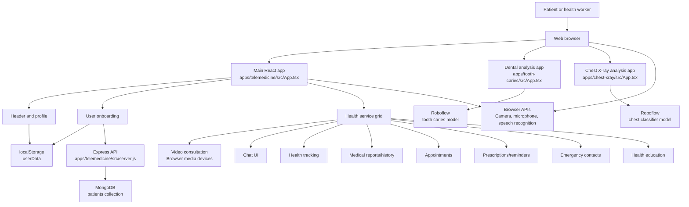
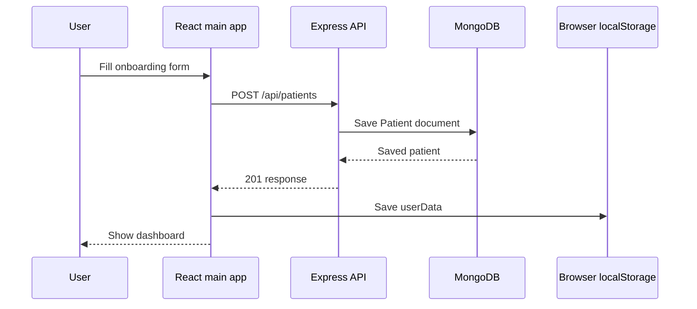
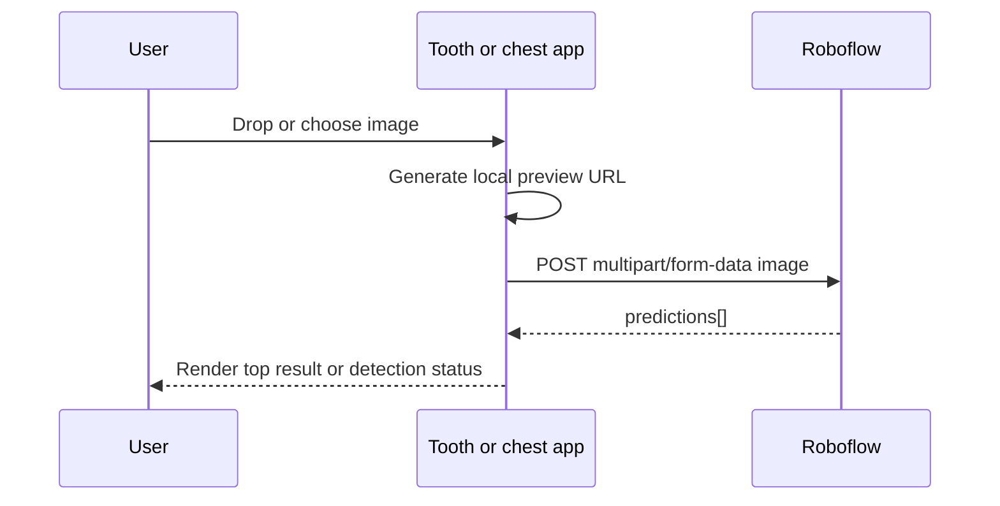

# Avinya

Avinya is a rural telemedicine prototype built with React, TypeScript, Vite, Tailwind CSS, Express, and MongoDB. The repository contains a main patient-facing health app plus two independent medical image analysis demos for dental caries and chest X-ray classification.

The project is designed around fast access to basic healthcare workflows: patient onboarding, video consultation, appointment booking, vitals tracking, medical records, prescriptions, medication reminders, emergency contacts, health education, and image-based screening demos.

> Health disclaimer: this project is a software prototype. It must not be used as a replacement for licensed medical care, diagnosis, emergency response, or regulated clinical decision-making.

## Table of Contents

- [Project Overview](#project-overview)
- [Repository Structure](#repository-structure)
- [Architecture](#architecture)
- [Runtime Data Flow](#runtime-data-flow)
- [Tech Stack](#tech-stack)
- [Main App Features](#main-app-features)
- [Image Analysis Apps](#image-analysis-apps)
- [Backend API](#backend-api)
- [Environment Variables](#environment-variables)
- [Getting Started](#getting-started)
- [Available Scripts](#available-scripts)
- [Development Notes](#development-notes)
- [Security and Privacy Notes](#security-and-privacy-notes)
- [Known Limitations](#known-limitations)
- [Troubleshooting](#troubleshooting)
- [Deployment Guide](#deployment-guide)
- [Suggested Roadmap](#suggested-roadmap)

## Project Overview

This repository currently contains three Vite apps:

| Area | Path | Purpose |
| --- | --- | --- |
| Main telemedicine app | `apps/telemedicine/src/` | Patient onboarding, health dashboard, consultation UI, records, appointments, prescriptions, reminders, emergency contacts, and education. |
| Backend server | `apps/telemedicine/src/server.js` | Express API for patient onboarding data, backed by MongoDB through Mongoose. |
| Dental image analysis app | `apps/tooth-caries/` | Uploads a dental image and calls Roboflow to detect possible tooth caries. |
| Chest X-ray analysis app | `apps/chest-xray/` | Uploads a chest X-ray image and calls Roboflow to classify possible disease labels. |

The apps are not configured as a formal npm workspace. Each app has its own `package.json`, `package-lock.json`, Vite config, Tailwind config, ESLint config, and TypeScript config.

## Repository Structure

```text
Avinya/
  README.md                    # Full project documentation
  .gitignore                   # Repository-level ignore rules

  apps/
    telemedicine/
      .env.example             # Backend/server environment example
      package.json             # Main app and Express server scripts/dependencies
      vite.config.ts           # Main Vite config
      tailwind.config.js       # Main Tailwind content config
      eslint.config.js         # Main ESLint flat config
      tsconfig*.json           # Main TypeScript configs
      index.html               # Main Vite HTML entry
      src/
        main.tsx               # React entry point
        App.tsx                # Main telemedicine app shell and service router
        index.css              # Tailwind directives
        server.js              # Express + MongoDB backend
        components/
          Header.tsx
          UserOnboarding.tsx
          AppointmentSystem.tsx
          DoctorChat.tsx
          EmergencyContacts.tsx
          HealthEducation.tsx
          HealthTracking.tsx
          MedicalHistory.tsx
          MedicalReports.tsx
          MedicationReminders.tsx
          PrescriptionManager.tsx

    tooth-caries/
      package.json             # Dental image analysis app
      src/
        App.tsx                # Dental upload and Roboflow detection flow
        main.tsx
        index.css

    chest-xray/
      package.json             # Chest X-ray image analysis app
      src/
        App.tsx                # Chest upload and Roboflow classification flow
        components/
          FileUpload.tsx
          LanguageToggle.tsx
        i18n/
          i18n.ts
          translations.ts
```

## Architecture



### Architectural Boundaries

| Boundary | Current behavior |
| --- | --- |
| Main frontend | React state drives selected services. Tailwind classes style the UI. User data is loaded from and saved to `localStorage`. |
| Backend API | Only patient onboarding data is persisted. API is implemented in one Express file with one Mongoose model. |
| Database | MongoDB stores `Patient` documents with `createdAt` and `updatedAt` timestamps. |
| Image analysis apps | Dental and chest apps call Roboflow directly from the browser with uploaded image files. |
| Browser capabilities | Video consultation uses `navigator.mediaDevices.getUserMedia`. Voice input uses `webkitSpeechRecognition`, which is browser-specific. |
| Internationalization | The main app uses local translation objects. The chest app uses `i18next` and `react-i18next`. |

## Runtime Data Flow

### Patient Onboarding Flow



### Image Analysis Flow



## Tech Stack

| Layer | Technology |
| --- | --- |
| Frontend framework | React 18 |
| Language | TypeScript for frontend, JavaScript for backend server |
| Build tool | Vite 5 |
| Styling | Tailwind CSS 3 |
| Icons | Lucide React |
| Backend | Node.js, Express 4 |
| Database | MongoDB with Mongoose |
| HTTP client | Fetch in the main app, Axios in image apps |
| File uploads | `react-dropzone` in image apps |
| i18n | Local translation maps and `i18next` in the chest app |
| Linting | ESLint 9 flat config, TypeScript ESLint, React Hooks plugin |

## Main App Features

The main app lives in `apps/telemedicine/src/`.

| Feature | Component / file | What it does | Persistence |
| --- | --- | --- | --- |
| User onboarding | `UserOnboarding.tsx` | Collects name, age, gender, phone, and address. Supports speech input through `webkitSpeechRecognition`. Posts data to backend. | MongoDB and `localStorage` |
| Dashboard shell | `App.tsx` | Holds language, selected service, user state, camera state, and service definitions. | React state |
| Header/profile | `Header.tsx` | Shows app name, profile dropdown, language selector, date/time, and logout. | Reads `userData` from React state |
| Video consultation | `App.tsx` | Shows doctor cards, availability, ratings, languages, and starts/stops camera/microphone stream. | Browser media stream only |
| Chat with doctor | `App.tsx` | Simple static chat panel with text input. | React state only |
| AI doctor chat component | `DoctorChat.tsx` | Standalone symptom-response chat with basic keyword matching and voice input. | Not currently mounted in `App.tsx` |
| Vitals tracking | `HealthTracking.tsx` | Simulates blood pressure, heart rate, weight, temperature, and health trend text. | React state only |
| Medical reports | `MedicalReports.tsx` | Shows static lab/radiology/cardiology reports with view/download/share controls. | React state only |
| Appointments | `AppointmentSystem.tsx` | Lets the user select doctor, date, and available time slot; confirms with alert. | React state only |
| Prescriptions | `PrescriptionManager.tsx` | Shows active prescriptions, dosage, frequency, dose counts, and medication schedule. | React state only |
| Medication reminders | `MedicationReminders.tsx` | Adds reminders, toggles completion state, and shows notification settings UI. | React state only |
| Emergency contacts | `EmergencyContacts.tsx` | Lists emergency numbers and personal contacts; supports adding/deleting contacts. | React state only |
| Health education | `HealthEducation.tsx` | Shows filterable health resources and featured content. | React state only |
| Medical history | `MedicalHistory.tsx` | Shows chronic conditions and a timeline of consultations, vaccination, and lab test events. | React state only |

### Main App State Model

`apps/telemedicine/src/App.tsx` coordinates the major state for the main app:

```text
selectedService     Which service panel is currently open
language            English or Hindi UI mode
userData            Onboarded user profile
showOnboarding      Whether the onboarding screen is visible
showCamera          Whether video consultation camera is active
selectedDoctor      Doctor selected for a video consultation
```

### Patient Model

`apps/telemedicine/src/server.js` defines the `Patient` schema:

```js
{
  name: String,       // required, trimmed
  age: Number,        // required, minimum 0
  gender: String,     // required: male, female, or other
  phone: String,      // required, trimmed
  address: String,    // required, trimmed
  createdAt: Date,
  updatedAt: Date
}
```

## Image Analysis Apps

### Dental Caries Detection

Path: `apps/tooth-caries/`

The dental app accepts a dental image through drag-and-drop or file picker, previews the upload, sends it to Roboflow, and displays whether caries were detected based on the returned predictions.

Supported file extensions:

- `.jpeg`
- `.jpg`
- `.png`
- `.bmp`

Important implementation details:

- Uses `react-dropzone` for file selection.
- Uses `axios` for the multipart upload.
- Calls Roboflow directly from `apps/tooth-caries/src/App.tsx`.
- Has a hard-coded link to the chest app at `http://localhost:5174/`.

### Chest X-Ray Classification

Path: `apps/chest-xray/`

The chest app accepts an X-ray image, previews it, sends it to Roboflow, chooses the prediction with the highest confidence, and displays the top class.

Important implementation details:

- Uses `react-dropzone`.
- Uses `axios.post` with `multipart/form-data`.
- Uses `i18next` and `react-i18next` for translation strings.
- Has a hard-coded link back to the dental app at `http://localhost:5173/`.
- `FileUpload.tsx` and `LanguageToggle.tsx` exist as reusable components, though the current `App.tsx` implements its own upload and language button UI.

## Backend API

The backend is implemented in `apps/telemedicine/src/server.js`.

Base URL in local development:

```text
http://localhost:5000
```

| Method | Path | Purpose |
| --- | --- | --- |
| `GET` | `/` | Health check. Returns server status and MongoDB connection state. |
| `POST` | `/api/patients` | Creates a patient from onboarding form data. |
| `GET` | `/api/patients` | Returns all patients sorted by newest first. |

### POST /api/patients

Request body:

```json
{
  "name": "Asha Kumar",
  "age": "35",
  "gender": "female",
  "phone": "+91 98765 43210",
  "address": "Village Road, District"
}
```

Successful response:

```json
{
  "message": "Patient added successfully",
  "patient": {
    "name": "Asha Kumar",
    "age": 35,
    "gender": "female",
    "phone": "+91 98765 43210",
    "address": "Village Road, District",
    "createdAt": "...",
    "updatedAt": "..."
  }
}
```

Validation errors return HTTP `400`. Other server/database errors return HTTP `500`.

## Environment Variables

Copy `.env.example` to `.env` inside `apps/telemedicine/` before running the backend.

```powershell
cd C:\Users\Hema\Downloads\Avinya\apps\telemedicine
Copy-Item .env.example .env
```

| Variable | Used by | Default / example | Description |
| --- | --- | --- | --- |
| `PORT` | Express server | `5000` | Port for `apps/telemedicine/src/server.js`. |
| `NODE_ENV` | Express server | `development` | Runtime environment label. |
| `MONGO_URI` | Express server | `mongodb://localhost:27017/telemedicine` | MongoDB connection string. |
| `CORS_ORIGIN` | Express server | `http://localhost:5173,http://localhost:3000` | Comma-separated frontend origins allowed by CORS. |
| `VITE_API_URL` | Main React app | `http://localhost:5000` fallback in code | Optional frontend API base URL for onboarding form submission. |

The Roboflow image apps currently keep their API key in the frontend source code. For production, move image analysis behind a backend proxy or serverless function and keep the Roboflow key in server-side environment variables.

## Getting Started

### Prerequisites

- Node.js 18 or newer
- npm
- MongoDB running locally, or a MongoDB Atlas connection string
- A modern browser
- Camera/microphone permission for video consultation
- A browser with `webkitSpeechRecognition` support for speech input, such as Chrome

### 1. Run the Main Telemedicine App

Use two terminals: one for the backend and one for the frontend.

Terminal 1: backend server

```powershell
cd C:\Users\Hema\Downloads\Avinya\apps\telemedicine
npm install
Copy-Item .env.example .env
npm run server
```

Terminal 2: frontend

```powershell
cd C:\Users\Hema\Downloads\Avinya\apps\telemedicine
npm run dev
```

Open:

```text
http://localhost:5173
```

Backend health check:

```text
http://localhost:5000
```

### 2. Run the Dental App

```powershell
cd C:\Users\Hema\Downloads\Avinya\apps\tooth-caries
npm install
npm run dev -- --port 5173
```

Open:

```text
http://localhost:5173
```

### 3. Run the Chest X-Ray App

```powershell
cd C:\Users\Hema\Downloads\Avinya\apps\chest-xray
npm install
npm run dev -- --port 5174
```

Open:

```text
http://localhost:5174
```

### Port Notes

The main app, dental app, and chest app are separate Vite apps. Vite defaults to port `5173`, so only one can use that port at a time.

The dental and chest apps have hard-coded navigation links that assume:

```text
Dental app: http://localhost:5173
Chest app:  http://localhost:5174
```

If the main app is already running on `5173`, either stop it before testing the dental/chest pair or run the image apps on different ports and update those links in code.

## Available Scripts

### Telemedicine App

Run from `Avinya/apps/telemedicine/`.

| Script | Command | Purpose |
| --- | --- | --- |
| `dev` | `npm run dev` | Starts the main Vite dev server. |
| `server` | `npm run server` | Starts the Express/MongoDB backend. |
| `build` | `npm run build` | Builds the main frontend for production. |
| `lint` | `npm run lint` | Runs ESLint over the telemedicine app. |
| `preview` | `npm run preview` | Serves the built frontend locally. |

### Dental App

Run from `Avinya/apps/tooth-caries/`.

| Script | Command | Purpose |
| --- | --- | --- |
| `dev` | `npm run dev` | Starts the dental Vite dev server. |
| `build` | `npm run build` | Builds the dental app. |
| `lint` | `npm run lint` | Runs ESLint for the dental app. |
| `preview` | `npm run preview` | Serves the dental production build locally. |

### Chest App

Run from `Avinya/apps/chest-xray/`.

| Script | Command | Purpose |
| --- | --- | --- |
| `dev` | `npm run dev` | Starts the chest Vite dev server. |
| `build` | `npm run build` | Builds the chest app. |
| `lint` | `npm run lint` | Runs ESLint for the chest app. |
| `preview` | `npm run preview` | Serves the chest production build locally. |

## Build Commands

Main app:

```powershell
cd C:\Users\Hema\Downloads\Avinya\apps\telemedicine
npm run build
```

Dental app:

```powershell
cd C:\Users\Hema\Downloads\Avinya\apps\tooth-caries
npm run build
```

Chest app:

```powershell
cd C:\Users\Hema\Downloads\Avinya\apps\chest-xray
npm run build
```

## Development Notes

- The telemedicine app uses React state heavily. Most feature panels are prototype screens with static seed data.
- Onboarding is the only main-app flow that writes to the backend.
- Logout clears `localStorage` in the browser, but it does not delete patient records from MongoDB.
- `DoctorChat.tsx` has a more complete symptom-chat experience, but the main `App.tsx` currently renders a simpler inline chat panel instead.
- Several telemedicine app translations are embedded directly in `App.tsx` and `UserOnboarding.tsx`.
- The chest app has a more formal i18n setup under `apps/chest-xray/src/i18n/`.
- Each app has its own lockfile. Install dependencies separately in each app directory.
- The project has lint/build scripts, but no automated unit, integration, or end-to-end test suite yet.

## Security and Privacy Notes

This project handles health-related and personal data, so production use would require substantial hardening.

Key concerns:

- Patient data is personal information. Protect MongoDB credentials and use HTTPS in production.
- The browser stores user profile data in `localStorage`, which is convenient for prototypes but not ideal for sensitive health data.
- There is no authentication or authorization.
- There is no rate limiting.
- There is no audit log.
- There is no encryption layer beyond what the deployment platform provides.
- Roboflow API keys should not be exposed in frontend code.
- Uploaded medical images are sent to a third-party API. Users should be informed before upload.
- AI/image-analysis results need clinical validation before any real medical use.
- Emergency guidance should be reviewed by qualified healthcare professionals for the target region.

## Known Limitations

- The main frontend and image analysis apps are independent; there is no shared router or unified deployment setup.
- Most healthcare workflows are mock/prototype flows and do not persist data.
- Hindi text appears in several files, but some strings may need UTF-8 cleanup depending on editor/terminal encoding.
- The backend schema is minimal and only supports patients.
- The backend lives in a single file, which is fine for a prototype but should be split into routes, models, config, and middleware for a larger app.
- The main app has some unused state/imports and placeholder controls.
- Camera, microphone, and speech recognition features depend on browser support and user permissions.
- The image apps rely on live Roboflow availability, valid credentials, network access, and model quotas.

## Troubleshooting

### Onboarding Fails to Submit

Check that:

- MongoDB is running.
- `npm run server` is running from `apps/telemedicine/`.
- `MONGO_URI` is correct in `.env`.
- `VITE_API_URL` points to the backend if the frontend is not using `http://localhost:5000`.
- `CORS_ORIGIN` includes the frontend origin.

### MongoDB Connection Error

For local MongoDB, make sure the database service is running and that this URI works:

```text
mongodb://localhost:27017/telemedicine
```

For MongoDB Atlas, replace `MONGO_URI` in `.env` with the Atlas connection string and allow your IP address in Atlas network access settings.

### Port Already in Use

Start Vite on a specific port:

```powershell
npm run dev -- --port 5175
```

### Camera or Microphone Does Not Work

Check that:

- The browser has permission to access camera and microphone.
- The page is running on `localhost` or HTTPS.
- Another app is not already using the camera.

### Speech Input Does Not Work

The app checks for `webkitSpeechRecognition`, which is not supported in every browser. Try Chrome or a Chromium-based browser.

### Image Analysis Fails

Check that:

- The Roboflow key is valid.
- The model endpoint is reachable.
- The image format is JPEG, PNG, or BMP.
- The browser can access the network.
- The Roboflow project still exists and has available quota.

### Hindi Text Looks Garbled

Make sure files are saved as UTF-8 and that the terminal/editor is displaying UTF-8 correctly. If strings are already corrupted in source, replace them with clean UTF-8 Hindi text.

## Deployment Guide

### Main App Frontend

The main React app can be deployed to static hosting such as Vercel, Netlify, or any static file server.

Build command:

```powershell
cd C:\Users\Hema\Downloads\Avinya\apps\telemedicine
npm run build
```

Output directory:

```text
apps/telemedicine/dist/
```

Set `VITE_API_URL` to the deployed backend URL.

### Backend

Deploy `apps/telemedicine/src/server.js` to a Node-capable host.

Required production environment variables:

```text
PORT
NODE_ENV=production
MONGO_URI
CORS_ORIGIN
```

Use MongoDB Atlas or another managed MongoDB service for production.

### Image Apps

The dental and chest apps can be built and deployed separately:

```powershell
cd C:\Users\Hema\Downloads\Avinya\apps\tooth-caries
npm run build

cd C:\Users\Hema\Downloads\Avinya\apps\chest-xray
npm run build
```

For production, do not call Roboflow with a frontend-exposed API key. Use a backend endpoint that accepts the image, calls Roboflow server-side, and returns sanitized prediction results to the browser.

## Suggested Roadmap

- Convert `apps/` into a formal npm workspace if shared scripts or packages are needed.
- Move the backend into `routes/`, `models/`, `controllers/`, and `config/`.
- Add authentication for patients, doctors, and health workers.
- Persist appointments, reports, prescriptions, reminders, and emergency contacts.
- Replace hard-coded doctors and demo data with API-backed data.
- Mount or merge `DoctorChat.tsx` into the main chat service.
- Move Roboflow calls behind the backend.
- Move all API keys and secrets into server-side environment variables.
- Clean and verify Hindi translations.
- Add form validation with user-friendly messages.
- Add automated tests for backend API routes and critical frontend flows.
- Add end-to-end tests for onboarding and image upload flows.
- Add accessibility checks for forms, modals, and keyboard navigation.
- Add logging, monitoring, and error tracking for production deployments.

